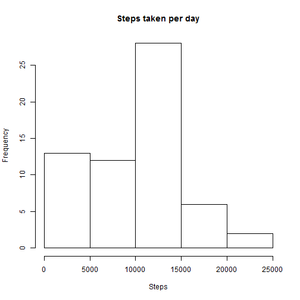
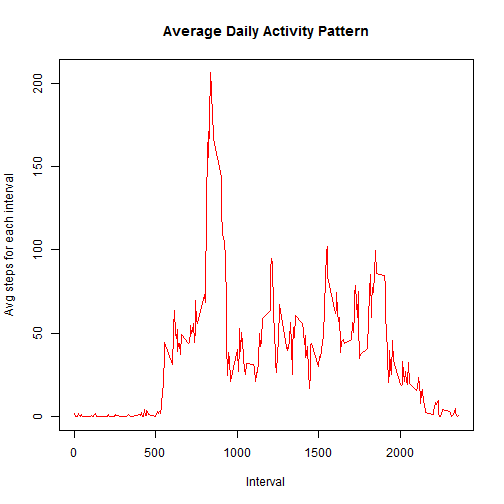
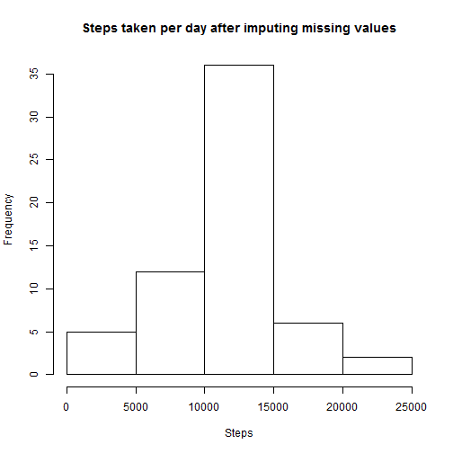
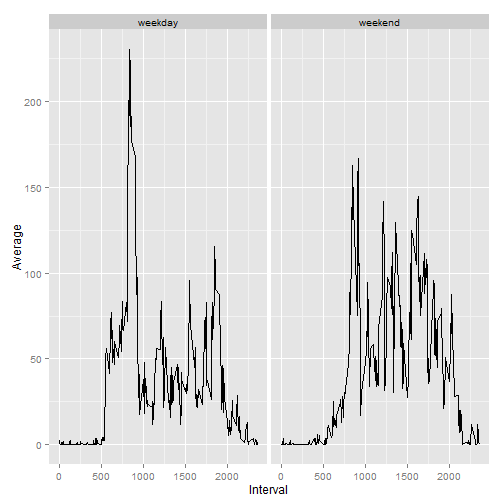

## Loading and preprocessing the data  
  
1.Unzip the files  
2.Read the csv into a data frame  


```r
unzip("activity.zip",exdir = "Data")
df<-read.csv("activity.csv")
```
  
**What is mean total number of steps taken per day?**  
Histogram of the total number of steps taken each day  

```r
ans<-aggregate(df$steps,by = list(df$date),sum,na.rm=TRUE)
hist(ans$x,main = "Steps taken per day",xlab = "Steps")
```

 
    

## What is mean total number of steps taken per day?  
**Mean of total steps per day:** 9354.2295082    
**Median of total steps per day:** 10395  


## What is the average daily activity pattern?  

```r
avg<-aggregate(df$steps,by =list(df$interval),mean,na.rm=TRUE)
plot(avg$Group.1,avg$x,col="red",type="l",xlab = "Interval",ylab="Avg steps for each interval",main="Average Daily Activity Pattern")
```

 
  
**The 5-minute interval, on average across all the days in the dataset, containing the maximum number of steps is** 835  


## Imputing missing values  
**The total number of missing values in the dataset are:** 2304  
  
Strategy to fill in the missing values is to use the the mean for that 5-minute interval using  the function "impute_missing":  

```r
impute_missing<-function(tdf,avg) {
  for (i in 1:nrow(tdf)){
    if(is.na(tdf[i,1])){
      na_interval<-tdf[i,3]
      interval_mean<-avg[avg$Group.1 == na_interval,2]
      tdf[i,1]<-interval_mean
    }  
  }
  tdf
}

df<-impute_missing(df,avg)
```
**Histogram of the total number of steps taken each day:**  

```r
ans2<-aggregate(df$steps,by = list(df$date),sum,na.rm=TRUE)
hist(ans2$x,main = "Steps taken per day after imputing missing values",xlab = "Steps")
```

 
  
**Mean of total steps per day:** 1.0766189 &times; 10<sup>4</sup>    
**Median of total steps per day:** 1.0766189 &times; 10<sup>4</sup>  

Thus we see these values differ from the estimates from the first part of the assignment  
Thus imputing missing data on the estimates of the total daily number of steps leads to the mean and median converging.  
  

  
Creating a new factor variable indicating weekend/weekday:  

```r
df[,"Day"]<-ifelse(weekdays(as.Date(df$date)) %in% c('Sunday','Saturday'),'weekend','weekday')
df[,"Day"]<-factor(df$Day,levels=c("weekday","weekend"),labels = c("weekday","weekend"))
```
  
Plotting the average number of steps taken, averaged across all weekday days or weekend days (y-axis):      

```r
library(ggplot2)
avg2<-aggregate(df$steps,by =list(df$interval,df$Day),mean,na.rm=TRUE)
names(avg2)<-c("Interval","Day","Average")
g<-ggplot(avg2, aes(Interval,Average))
g<-g+geom_line()+facet_grid(.~Day)
g
```

 


## Are there differences in activity patterns between weekdays and weekends?  
Yes it looks like weekdays see a higher highest average in comparison to weekends.

  
